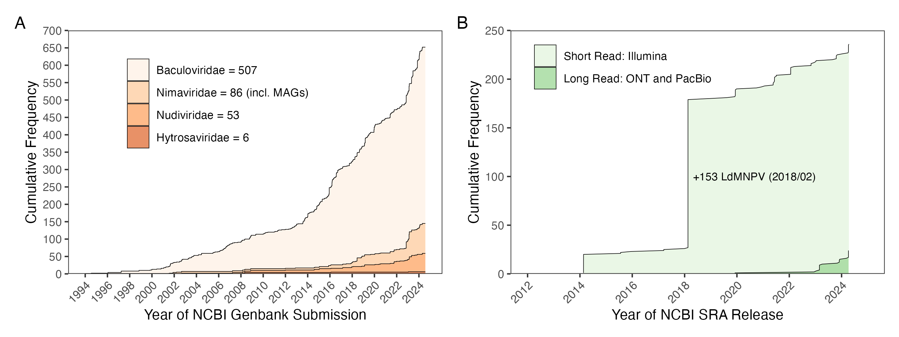

# Identifying Nanopore reads that span entire genomes of nuclear arthropod-specific large DNA viruses

The figures and content in this repository are derived from the following publication:

**Wennmann, J.T. (2024). Nanopore reads spanning the whole genome of arthropod-infecting large dsDNA viruses of the class Naldaviricetes enable assembly-free sequence analysis. Journal of General Virology, xxx xxx xxx. [DOI link to the publication]**

This work is licensed under the [Creative Commons Attribution 4.0 International (CC BY 4.0)](https://creativecommons.org/licenses/by/4.0/).

## Aim of this repository

-   Present and explain the code used to create the figures in the manuscript (Wennmann, 2024).

-   Learn how to approach Nanopore sequence data sets of NALDVs. It demonstrates the importance of carefully examining the data to avoid subsequent errors in the analysis.

-   Particular attention is paid to the detection of reads that may comprise entire genomes of NALDVs and represent individual viral genomes.

## Importance of Nanopore sequencing for NALDV genomes

Nanopore sequencing is becoming increasingly popular for sequencing the genomes of nuclear arthropod-specific large DNA viruses (NALDV). In particular, in combination with Illumina sequencing, it provides a highly accurate method for error-free decoding of large repetitive sequence regions. As of July 2024, hundreds of genomes in the Naldaviricetes class have been published in the NCBI Genbank. These are consensus sequences based on assemblies. Nanopore sequencing makes it possible for the first time to sequence significantly large fragments of NALDV genomes. It is even conceivable that entire genomes could be sequenced in single reads, enabling assembly-free analysis of NALDV genomes.

## Consensus genomes published on NCBI Genbank

To get an overview of the number of published NALDV genomes (as of July 2024), all NCBI Genbank entries found under the individual names of the virus families (Baculoviridae, Nudiviridae, Nimaviridae, Hytrosaviridae) are available in the directory /data/xml. A filter has been set to only allow sequences in the range of complete genomes. The list is probably not complete, but it is a good approximation of all genomes that are publicly available at this time.

The XML files are first read into R and converted into a data frame. The virus name (isolate, strain), accession number, genome length and publication date are extracted. As soon as the data has been imported, the image can be created from it using ggplot2 [(](https://github.com/wennj/naldv-whole-genome-reads/blob/main/output/NALDV_stats_on_Genbank_SRA.png)[Figure](output/NALDV_stats_on_Genbank_SRA.png)[ 1A)](https://github.com/wennj/naldv-whole-genome-reads/blob/main/output/NALDV_stats_on_Genbank_SRA.png).

[Click here for the R code used to create the ](output/NCBI_statistics.Rmd)[figure](NCBI_statistics.Rmd)[.](output/NCBI_statistics.Rmd)

## Sequence data available from NCBI SRA

Analysing the availability of Illumina and Nanopore data sets on NCBI SRA is a bit easier. You can search and filter for the datasets on NCBI. All hits can be downloaded directly as a CSV files. These files then serve as input for the subsequent analysis. The result is a plot showing the time course of the published SRA data sets (Illumina and Nanopore) as of July 2024 [(Figure 1B)](output/NALDV_stats_on_Genbank_SRA.png).

[Click here for the R code used to create the figure.](NCBI_statistics.Rmd)

