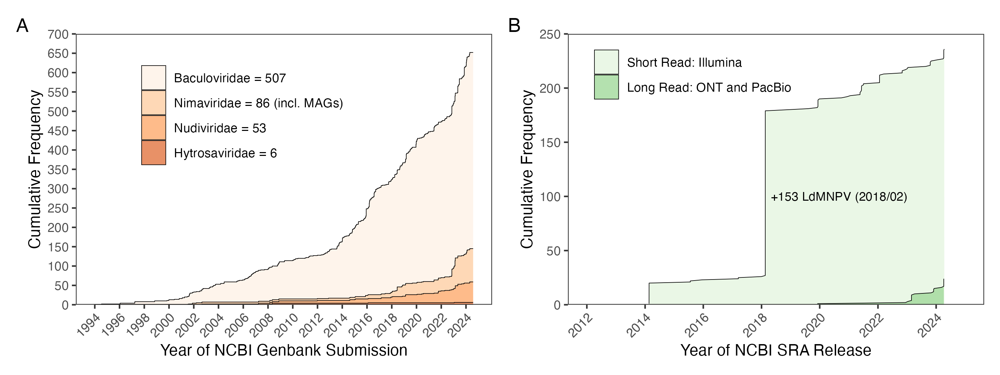
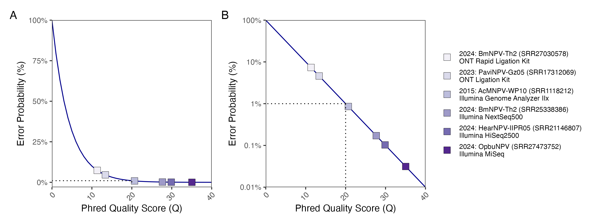
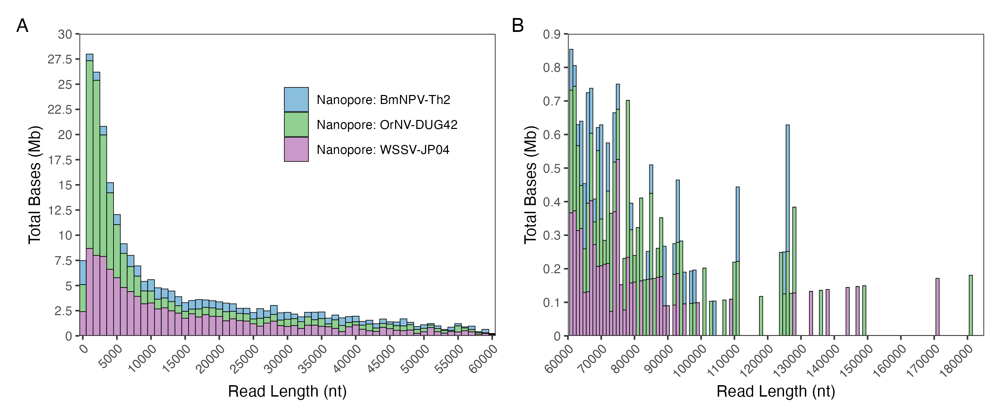
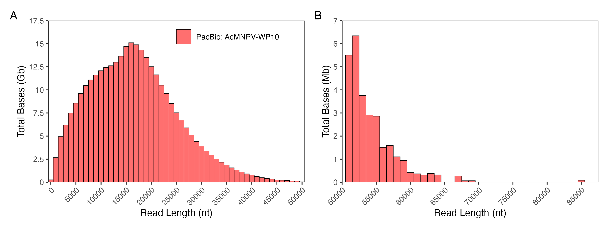
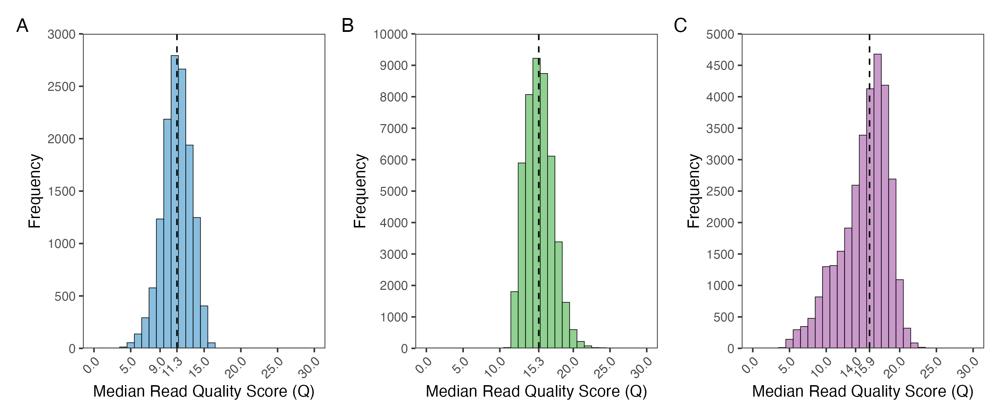
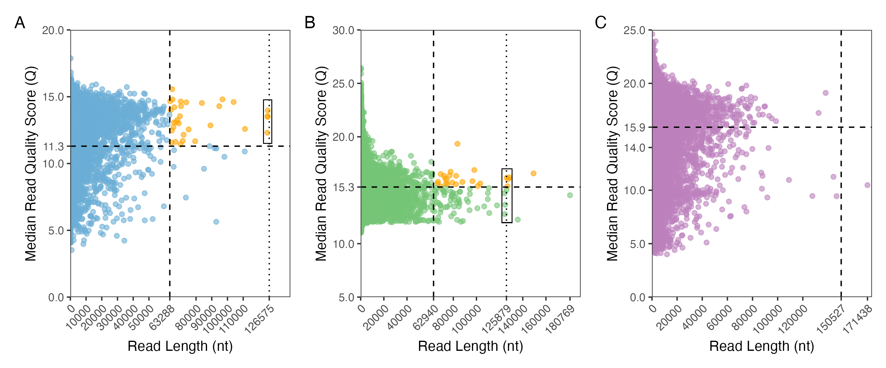
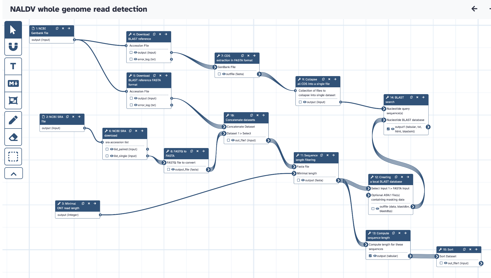
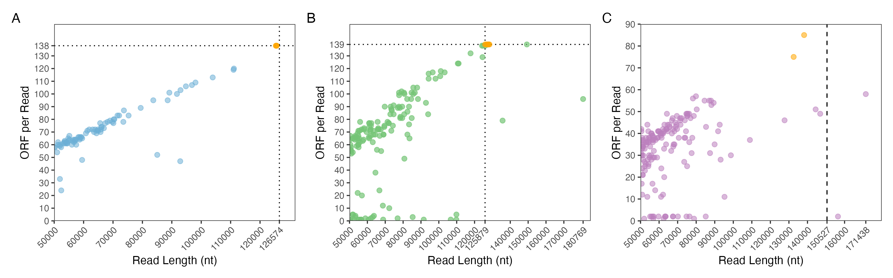
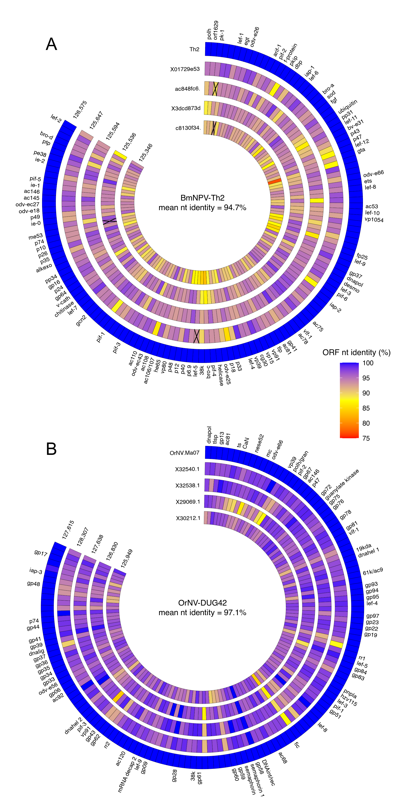

# A workflow to detect Nanopore reads that span entire genomes of nuclear arthropod-specific large DNA viruses

The figures and content in this repository are derived from the following publication:

**Wennmann, J.T. (submitted). Nanopore reads spanning the whole genome of arthropod-infecting large dsDNA viruses of the class Naldaviricetes enable assembly-free sequence analysis. [DOI link to the publication]**

## Aim of this repository

-   Learn how to approach Nanopore sequence data sets of NALDVs. It demonstrates the importance of carefully examining the data to avoid subsequent errors in the analysis.

-   [Provide and explain a Galaxy workflow for the detection of open reading frames (ORF/CDS) on individual Nanopore reads.](https://usegalaxy.eu/published/workflow?id=08f41680101a1a45)

-   Present and explain the code used to create the figures in the manuscript (Wennmann, submitted).

-   Particular attention is paid to the detection of reads that may comprise entire genomes of NALDVs and represent individual viral genomes.

## Importance of Nanopore sequencing for NALDV genomes

Nanopore sequencing is becoming increasingly popular for sequencing the genomes of nuclear arthropod-specific large DNA viruses (NALDV). In particular, in combination with Illumina sequencing, it provides a highly accurate method for error-free decoding of large repetitive sequence regions. As of July 2024, hundreds of genomes in the Naldaviricetes class have been published in the NCBI Genbank. These are consensus sequences based on assemblies. Nanopore sequencing makes it possible for the first time to sequence significantly large fragments of NALDV genomes. It is even conceivable that entire genomes could be sequenced in single reads, enabling assembly-free analysis of NALDV genomes.

## Sequencing data published on NCBI Genbank and NCBI SRA

To get an overview of the number of published NALDV genomes (as of July 2024), all NCBI Genbank entries found under the individual names of the virus families (Baculoviridae, Nudiviridae, Nimaviridae, Hytrosaviridae) are available in the directory /data/xml. A filter has been set to only allow sequences in the range of complete genomes. The list is probably not complete, but it is a good approximation of all genomes that are publicly available at this time.

The XML files are first read into R and converted into a data frame. The virus name (isolate, strain), accession number, genome length and publication date are extracted. As soon as the data has been imported, the image can be created from it using ggplot2.

Analysing the availability of Illumina and Nanopore data sets on NCBI SRA is a bit easier. You can search and filter for the datasets on NCBI. All hits can be downloaded directly as a CSV files. These files then serve as input for the subsequent analysis. The result is a plot showing the time course of the published SRA data sets (Illumina and Nanopore) as of July 2024.

[Click here for the R code used to create the figure.](NCBI_statistics.Rmd)

## Quality of sequencing techniques

‘Sequencing by synthesis’ and Nanopore sequencing are based on completely different methods. While Illumina sequencing (sequencing by synthesis) generates short reads that are extremely accurate, the probability of error is much higher for the long reads of Nanopore sequencing. The following graphic was created to illustrate this. The X-axis shows the Phred quality score (Q), which was converted into the error probability (Y-axis): $$
P = 10^{-\frac{Q}{10}}
$$ The values of selected raw sequencing data, which is available on NCBI SRA, were visualized by this plot. The vertical and horizontal dashed lines connect Q = 20 with the corresponding P = 1%.

[Click here for the R code used to create the figure.](https://github.com/wennj/naldv-whole-genome-reads/blob/main/quality_score_visualization.R)

## Read length distribution

To determine the length of Nanopore reads from a sequencing run, it is best to create a distribution of sequenced DNA fragments. In the present example, three data sets of BmNPV-Th2 (family Baculoviridae), OrNV-DUG42 (family Nudiviridae) and WSSV-JP04 (family Nimaviridae) were analysed with regard to their length distribution:

| Name        | NCBI SRA Number | Reference                                    |
|----------------|----------------|----------------------------------------|
| BmNPV-Th2   | SRR27030578     | <https://doi.org/10.1016/j.jip.2024.108221>  |
| OrNV-DUG42  | SRR21977634     | <https://doi.org/10.1128/mra.00126-23>       |
| WSSV-JP04   | DRR420912       | <https://doi.org/10.1007/s12562-023-01715-4> |
| AcMNPV-WP10 | SRR10566658     | <https://doi.org/10.1093/ve/vez060>          |

[Click here for the R code used to create the figure.](https://github.com/wennj/naldv-whole-genome-reads/blob/main/2_length_quality_statistics.Rmd)

Below the read length distribution of PacBio reads of AcMNPV-WP10.

## Read quality distribution

One of the most important quality characteristics of Nanopore sequencing is its quality. If the quality is calculated individually for each read, the quality of the entire sequencing runcan be represented as a distribution. This was done for the NCBI SRA data sets of (A) BmNPV-Th2, (B) OrNV-DUG42 and (C) WSSV-JP04.

[Click here for the R code used to create the figure.](https://github.com/wennj/naldv-whole-genome-reads/blob/main/2_length_quality_statistics.Rmd)

## Read length and quality comparison

The length of the reads can also be compared with their quality, which allows to test for a possible correlation. It provides information on whether certain reads possibly cover the entire genome of the viruses in terms of length and whether they are of sufficient quality. The dashed lines indicate the average read quality (horizontal line) and half the length of the virus genome (vertical line). The vertical dotted line indicates the full length of the virus genome (A = BmNPV-Th2, B = OrNV-DUG42, C = WSSV-JP04). Reads that span potentially the entire genome are surrounded by a square.

[Click here for the R code used to create the figure.](https://github.com/wennj/naldv-whole-genome-reads/blob/main/2_length_quality_statistics.Rmd)

## Galaxy workflow for CDS per read detection

The core of the analysis for finding reads that cover the entire NALDV genome is a bioinformatic workflow for detecting the coding sequence (CDS) on each individual Nanopore read. If a NALDV genome has been successfully sequenced, (almost) all of its CDS must also be present on the corresponding read. If only parts of the genome have been sequenced, fewer CDS should be found. In other words, a linear relationship between the length of the nanopore read and the number of encoded CDS should exist. To identify the CDS on each read, a local blastn is performed based on a database of the sequenced NALDV genome. Therefore, it is first necessary that the genome is assembled and annotated. This can also be done in advance by a genome assembly and annotation. The workflow provided below requires

-   a NCBI SRA dataset and

-   a fully sequenced and annotated NALDV genome from NCBI Genbank in Genbank format.

If you are using your own data that has not yet been published on NCBI Genbank and SRA, the workflow can be adapted to work with two FASTA files: (i) FASTA file with all CDS and (ii) FASTA file with all Nanopore reads.

[Here is a direct link to the workflow on usegalaxy.eu](https://usegalaxy.eu/u/wennmann/w/naldv-whole-genome-read-detection)

[The Galaxy workflow file can be found here.](https://github.com/wennj/naldv-whole-genome-reads/tree/main/data/galaxy_workflow)

## CDS per detected read

Since we perform the blast for each read individually, we can calculate the number of CDS for each read from the blast hit table. At the same time, we already know the length of all Nanopore reads (see above). The number of detected CDS and the length of the read can be connected in R by the read's name. Thus, we can relate the length of the read to the number of CDS.

[Click here for the R code used to create the figure.](https://github.com/wennj/naldv-whole-genome-reads/blob/main/3_CDS_per_read_statistic.Rmd)

## Circular CDS presentation

In the last step, the reads with the highest number of CDSs can be visualized in a circular plot. Of course, another type of plot is also possible, e.g. a matrix. However, the circular plot adequately reflects the circular dsDNA genome of the NALDV. The circular plot shows that some reads encode all CDSs of a NALDV genome and thus represent the entire genome.

[Click here for the R code used to create the figure.](https://github.com/wennj/naldv-whole-genome-reads/blob/main/4_circular_read_plot.Rmd)

{width="40%"}
